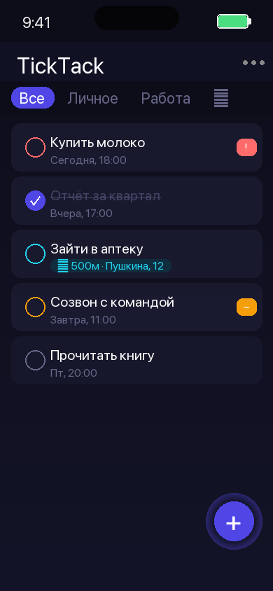
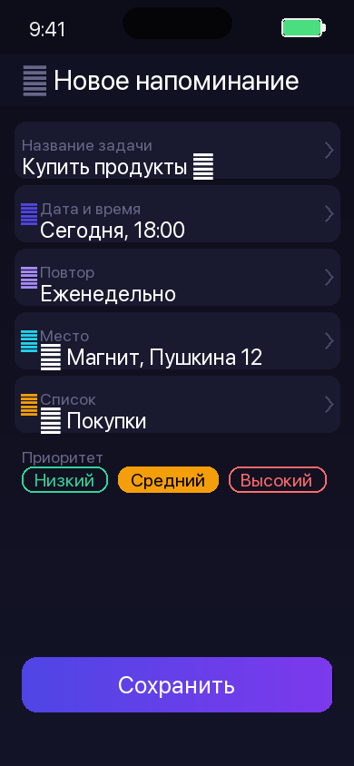
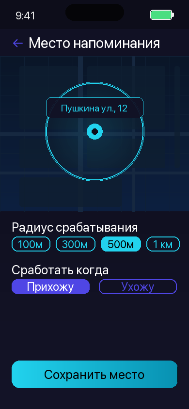

<div align="center">


# TickTack

**Smart reminders. Right time. Right place.**

[](https://github.com/Morewen7/TickTack)
[](https://reactnative.dev)
[](https://www.typescriptlang.org)
[](LICENSE)

---

🇷🇺 [**Русский**](#-ticktack--умные-напоминания) &nbsp;|&nbsp; 🇬🇧 [**English**](#-ticktack--smart-reminders)

</div>

---

## Screenshots

<div align="center">

&nbsp;&nbsp;

&nbsp;&nbsp;

</div>

<div align="center">
<sub>Home screen &nbsp;•&nbsp; New reminder &nbsp;•&nbsp; Location-based reminder</sub>
</div>

---

<br/>

## 🇷🇺 TickTack — Умные напоминания

> Приложение для напоминаний, которое работает там и тогда, когда это нужно — по времени и по месту.

### Возможности

| Функция | Описание |
|---|---|
| ⏰ **Напоминания по времени** | Разовые, ежедневные, еженедельные |
| 📍 **Геолокация** | Срабатывает при прибытии или уходе с места |
| ✅ **Действия в уведомлениях** | Выполнить или отложить без открытия приложения |
| 📋 **Несколько списков** | Цветовая кодировка, иконки, приватные списки |
| ↕️ **Перетаскивание** | Ручная расстановка приоритетов |
| ✓ **Подзадачи** | Разбивка на шаги с отслеживанием прогресса |
| 🗃 **Архив** | История выполненных задач |
| 📊 **Статистика** | Процент выполнения, серии, паттерны |
| 🔒 **Face ID / Touch ID** | Биометрическая блокировка списков |
| 🌙 **Тёмная и светлая тема** | 8 акцентных цветов на выбор |
| 🖼 **Свой фон** | Установи любое фото как фон |
| 📦 **Экспорт / Импорт** | JSON — данные принадлежат тебе |
| 🔲 **Виджет iOS** | Задачи на экране домой |
| 🔍 **Spotlight (iOS)** | Мгновенный поиск через систему |

### Стек технологий

```
React Native 0.76 (New Architecture — Bridgeless + Fabric)
TypeScript · AsyncStorage · Notifee · react-native-biometrics
react-native-reanimated · WidgetKit (Swift) · Native Geolocation
```

### Конфиденциальность

Все данные хранятся **локально на устройстве**. Никаких аккаунтов, облачной синхронизации, трекинга и рекламы.

### Бизнес-модель

- **Бесплатно** — полный базовый функционал, до 3 списков
- **Pro** (299 ₽/мес · 1 990 ₽/год) — безлимитные списки, виджет, геолокация, Face ID, статистика, темы

---

<br/>

## 🇬🇧 TickTack — Smart Reminders

> A reminder app that works exactly when and where you need it — by time and by place.

### Features

| Feature | Description |
|---|---|
| ⏰ **Time-based reminders** | One-time, daily, weekly schedules |
| 📍 **Location triggers** | Fire on arrival or departure from a place |
| ✅ **Notification actions** | Complete or snooze without opening the app |
| 📋 **Multiple lists** | Color coding, icons, private locked lists |
| ↕️ **Drag & drop** | Manual priority ordering |
| ✓ **Subtasks** | Break goals into steps, track progress |
| 🗃 **Archive** | Keep history of completed tasks |
| 📊 **Statistics** | Completion rates, streaks, patterns |
| 🔒 **Face ID / Touch ID** | Biometric lock for private lists |
| 🌙 **Dark & Light mode** | 8 accent colors to choose from |
| 🖼 **Custom background** | Set any photo as the app background |
| 📦 **Export / Import** | JSON — your data, your rules |
| 🔲 **iOS Widget** | Tasks on your home screen |
| 🔍 **Spotlight Search** | Find any reminder via iOS system search |

### Tech Stack

```
React Native 0.76 (New Architecture — Bridgeless + Fabric)
TypeScript · AsyncStorage · Notifee · react-native-biometrics
react-native-reanimated · WidgetKit (Swift) · Native Geolocation
```

### Privacy First

All data is stored **locally on your device**. No account required. No cloud sync. No tracking. No ads.

### Business Model

- **Free** — full core functionality, up to 3 lists
- **Pro** ($2.99/mo · $19.99/yr) — unlimited lists, widget, location reminders, Face ID, statistics, themes

---

<div align="center">
<sub><i>TickTack — Remember everything. Miss nothing.</i></sub>
</div>
