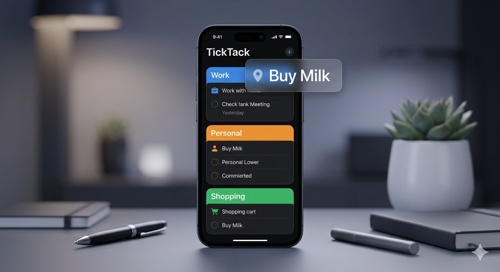

# TickTack

**Умное приложение для напоминаний, которое работает так, как думает твой мозг.**

Доступно для iOS и Android.

---

## Скриншоты

  

---

## Что такое TickTack?

TickTack — современное приложение для напоминаний и управления задачами, созданное для тех, кто хочет держать жизнь под контролем без лишнего шума перегруженных инструментов продуктивности.

Там, где другие приложения тонут в ненужных функциях, TickTack сосредоточен на одном: чтобы ты помнил важное именно тогда и там, где это нужно.

---

## Ключевые возможности

### Умные напоминания
Устанавливай напоминания по времени, дате и расписанию повторения. Ежедневно, еженедельно — TickTack следит за этим вместо тебя.

### Геолокационные напоминания
Получай уведомление, когда *прибываешь* или *уходишь* с определённого места. Проходишь мимо магазина? TickTack напомнит купить молоко раньше, чем ты об этом подумаешь.

### Действия в уведомлениях
Выполни или отложи напоминание прямо из уведомления — не открывая приложение. Один тап — и готово.

### Перетаскивание для приоритизации
Расставляй задачи в удобном порядке — просто удержи и перетащи.

### Несколько списков
Разделяй рабочие, личные, покупки и кастомные списки с цветовой кодировкой и иконками. Всё на своём месте.

### Подзадачи
Разбивай большие цели на маленькие шаги. Отслеживай прогресс по каждому.

### Архив
Выполнил важное? Заархивируй вместо удаления — история сохранится.

### Статистика
Следи за своей продуктивностью. Процент выполнения, серии, паттерны.

### Блокировка по Face ID / Touch ID
Твои задачи — личные. TickTack закрывается биометрической аутентификацией, доступ только у тебя.

### Тёмная и светлая тема
Плавное переключение с красивой анимацией. Акцентный цвет — на выбор из 8 вариантов.

### Кастомный фон
Установи своё фото как фон приложения. Сделай его своим.

### Экспорт и импорт
Твои данные принадлежат тебе. Экспортируй всё в JSON, импортируй куда угодно.

### Виджет для iOS
Видь предстоящие задачи прямо на экране домой — без открытия приложения.

### Поиск через Spotlight (iOS)
Мгновенно найди любое напоминание через системный поиск iOS.

---

## Технологии

TickTack построен на **React Native** — одна кодовая база для iOS и Android. Это значит более быструю разработку, единый опыт на обеих платформах и существенно меньшие затраты по сравнению с двумя нативными приложениями.

- **Frontend:** React Native 0.76, TypeScript
- **Хранилище:** Локальное на устройстве через AsyncStorage — аккаунт не нужен, данные на серверы не отправляются
- **Уведомления:** Notifee — расширенные уведомления с действиями на обеих платформах
- **Биометрия:** react-native-biometrics — Face ID, Touch ID, отпечаток пальца
- **Геолокация:** Нативная геолокация с фоновым мониторингом
- **Анимации:** React Native Reanimated — плавные взаимодействия на 60fps
- **Виджет iOS:** WidgetKit (Swift) с обменом данными через App Group

---

## Приватность прежде всего

TickTack хранит все данные **локально на устройстве**. Аккаунт не нужен. Никакой облачной синхронизации. Никакой слежки. Никакой рекламы. Твои напоминания никогда не покидают телефон, если ты сам не экспортируешь их.

---

## Бизнес-модель

**Freemium:**
- Бесплатно: полный базовый функционал, до 3 списков
- Pro (299 ₽/месяц или 1 990 ₽/год): безлимитные списки, виджет, геолокационные напоминания, Face ID, статистика, кастомные темы

**Целевая аудитория:**
- Возраст 18–45, активные пользователи смартфонов
- Студенты, специалисты, фрилансеры
- Те, кто пробовал другие приложения и бросил

---

*TickTack — Помни всё. Не пропусти ничего.*
